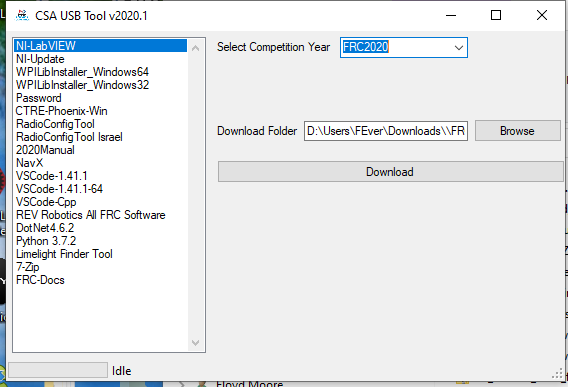

# py-csa-loader

Forked from the original C# version of the tool [CSA-USB-TOOL](http://github.com/JamieSinn/CSA-USB-Tool)

Tool to download all files in a given FIRST season needed to support teams.

This tool downloads all the installers/packages for a given FRC season. 
CSA's commonly need these on hand in a USB to help teams update to the
latest version or to diagnose issues.

The original version of this application (which I think it awsome) was 
written in C# and some anti-virus/scanners will call out this as having 
a Trojan embedded in the application.  In order to work around this on some
platforms, I have re-written it in basic python with a tkinter gui.  I have 
tried to keep the same functionality as the original.

